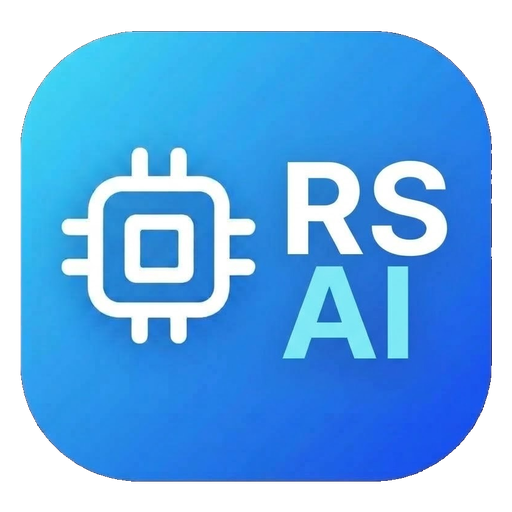
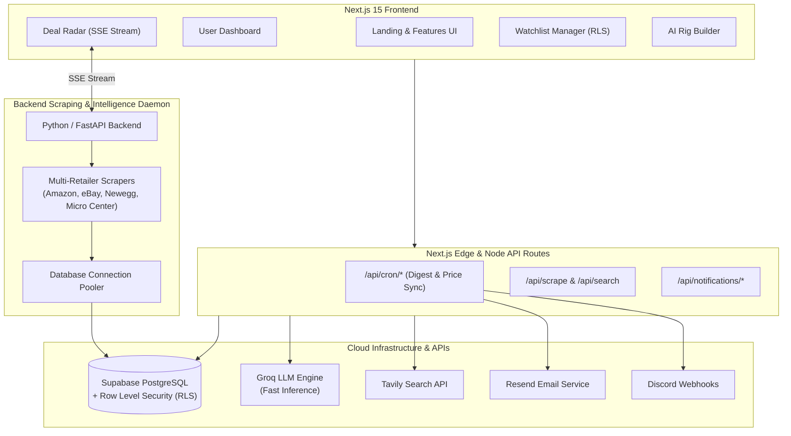

<div align="center">

  

  # RigScouter-AI

  ### Autonomous PC Hardware Deal Intelligence & Real-Time Price Tracker

  [](https://nextjs.org/)
  [](https://www.typescriptlang.org/)
  [](https://tailwindcss.com/)
  [](https://supabase.com/)
  [](https://www.prisma.io/)
  [](https://groq.com/)
  [](LICENSE)

  <p align="center">
    <a href="#key-features">Key Features</a> •
    <a href="#system-architecture">Architecture</a> •
    <a href="#ai-deal-scoring-tier-system">Deal Scoring</a> •
    <a href="#tech-stack">Tech Stack</a> •
    <a href="#getting-started">Getting Started</a> •
    <a href="#environment-variables">Environment</a>
  </p>

</div>

---

## ⚡ Overview

**RigScouter-AI** is an autonomous PC hardware deal intelligence platform engineered to eliminate manual price searching, deceptive retailer "sales", and missed flash drops.

By unifying multi-retailer web scrapers, a real-time Server-Sent Events (SSE) deal radar, quantitative AI deal scoring, and automated daily digests, RigScouter-AI helps gamers and PC builders pinpoint verified historical lows and secure optimal component pricing across major hardware retailers.

---

## 🚀 Key Features

### 🛰️ Real-Time Deal Radar (SSE Streaming)
- Live price drops and newly scouted discounts streamed directly to your browser via **Server-Sent Events (SSE)**.
- Visual flash badges indicate instantaneous price drops and newly verified deals without manual page refreshes.

### 🌐 Autonomous Multi-Retailer Scraping Engine
- Continuously tracks live hardware inventory and pricing across **Amazon** and **eBay**, with dedicated scraper pipelines rolling out for **Micro Center**, **Newegg**, **Best Buy**, and **B&H Photo**.
- Automatic canonical normalization transforms brand-specific partner SKUs (e.g. *ASUS Dual*, *MSI Ventus*, *Gigabyte Gaming OC*) into base canonical silicon models (e.g. *GeForce RTX 4070 Super*).

### 🎯 Algorithmic AI Deal Scoring (0–100 Scale)
- Cuts through manufactured discounts by analyzing:
  - Variance against official manufacturer **MSRP**.
  - Delta against **90-day rolling lowest price floors**.
  - Cross-retailer pricing spreads.
  - Stock availability and historical pricing volatility.

### 🛠️ AI Rig Builder & Compatibility Engine
- Enter your total budget, primary use case (Gaming, Productivity, Streaming, Balanced), and target resolution (1080p, 1440p, 4K).
- Groq-powered AI engine recommends compatible component configurations while evaluating estimated system wattage, socket compatibility, and bottleneck margins.

### 🔒 Personalized Watchlist with Supabase RLS
- User authentication and persistent hardware watchlists secured by **Supabase Row-Level Security (RLS)**.
- Set custom target price thresholds per component; the engine arms automated triggers the moment market prices drop below your threshold.
- Direct database query optimization provides instant sub-20ms dashboard loads.

### 📬 Scheduled Daily Price Digests & Flash Alerts
- Automated scheduled digests dispatched directly to your **Email** (via Resend) or **Discord webhook**.
- Highlights biggest 24-hour drops, 7-day trends, 30-day deltas, and All-Time Low (ATL) milestones with AI-generated executive summaries and cost-saving alternative recommendations.

---

## 📊 AI Deal Scoring Tier System

RigScouter-AI applies an objective, algorithmic deal scoring formula to help you distinguish genuine deals from artificial discounts:

| Score | Tier | Description | Action |
| :--- | :--- | :--- | :--- |
| **90 – 100** | 🔥 **Epic Deal** | All-time low or deep price drop below 90-day floor. | Immediate Buy |
| **80 – 89** | ⚡ **Great Deal** | Significantly below average market price and MSRP. | Strong Value |
| **65 – 79** | ⚖️ **Fair Price** | Standard retail pricing near normal MSRP. | Hold / Monitor |
| **< 65** | ⚠️ **Overpriced** | Above MSRP, scalped, or low price-to-performance ratio. | Avoid |

---

## 🏗️ System Architecture

RigScouter-AI operates as a high-performance modern decoupled system:



---

## 🛠️ Tech Stack

- **Framework**: [Next.js 15 (App Router)](https://nextjs.org/)
- **Language**: [TypeScript](https://www.typescriptlang.org/)
- **Styling**: [Tailwind CSS](https://tailwindcss.com/)
- **Database & Auth**: [Supabase (PostgreSQL with RLS)](https://supabase.com/)
- **ORM**: [Prisma](https://www.prisma.io/) (`@prisma/client`, `@prisma/adapter-pg`)
- **AI / LLM**: [Groq SDK](https://groq.com/) (Llama 3 / Mixtral for instant digest generation & compatibility checks)
- **Scraping & Discovery**: [Tavily](https://tavily.com/) & Custom Scraping Engine
- **Notifications**: [Resend](https://resend.com/) & Discord Webhooks
- **Edge Deployment**: [Cloudflare Pages](https://pages.cloudflare.com/) / `@cloudflare/next-on-pages` & Wrangler

---

## 📂 Project Structure

```
RigScouter-AI/
├── public/                     # Static assets and favicons
│   ├── logo.png                # RigScouter-AI brand logo
│   ├── favicon.ico             # Multi-resolution favicon
│   ├── favicon.png             # 32x32 standard favicon
│   ├── icon-192.png            # Web app icon (192x192)
│   └── icon-512.png            # Web app icon (512x512)
├── src/
│   ├── app/                    # Next.js App Router
│   │   ├── api/                # API routes (scrape, notifications, cron, components)
│   │   ├── dashboard/          # Watchlist & Deal Digest dashboard
│   │   ├── features/           # In-depth architectural feature showcase
│   │   ├── layout.tsx          # Root layout & meta tags
│   │   ├── page.tsx            # Interactive landing page & deal preview
│   │   └── globals.css         # Global styling & custom themes
│   ├── components/             # Reusable React components
│   │   ├── DealRadar.tsx       # Live SSE real-time price drop feed
│   │   ├── WatchlistManager.tsx# Watchlist CRUD with target price triggers
│   │   ├── DailyDigestPreview.tsx # AI digest viewer & frequency selector
│   │   ├── RigBuilderChat.tsx  # Interactive AI PC assembly & wattage checker
│   │   └── AuthModal.tsx       # Supabase email sign-in / registration
│   └── lib/                    # Core utilities & services
│       ├── ai/                 # Compatibility checker & digest generator
│       ├── db/                 # Supabase client, admin client, & Prisma setup
│       ├── scrapers/           # Live scrapers & trending hardware engines
│       └── types/              # Hardware TypeScript interfaces & schemas
├── prisma/
│   └── schema.prisma           # Prisma data models (HardwareComponent, WatchlistItem, DailyDigest)
├── supabase/                   # Supabase configuration & cron keep-alive SQL
└── wrangler.jsonc              # Cloudflare Pages deployment configuration
```

---

## 🤝 Contributing

Contributions, issues, and feature requests are welcome!
Feel free to open an issue or submit a pull request:

1. Fork the repository
2. Create your feature branch (`git checkout -b feature/amazing-feature`)
3. Commit your changes (`git commit -m 'Add some amazing feature'`)
4. Push to the branch (`git push origin feature/amazing-feature`)
5. Open a Pull Request

---

## 📄 License

This project is open-source and licensed under the [MIT License](LICENSE).